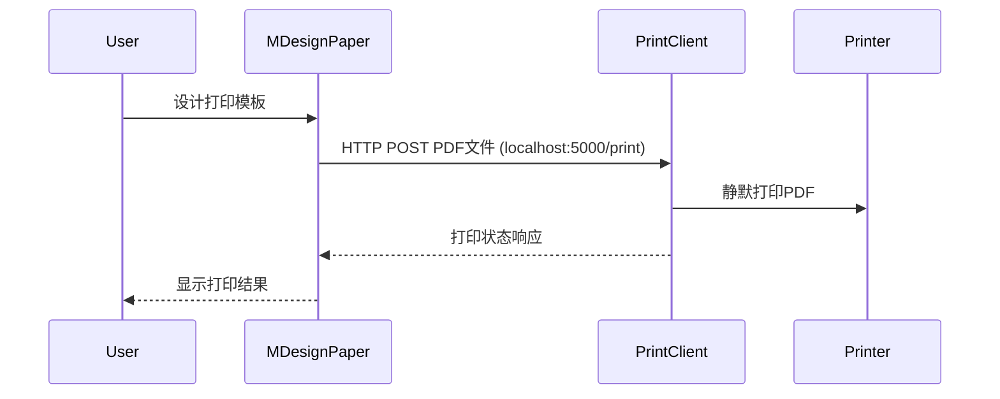

# Blazor-HiPrint 项目梳理文档

## 1. 项目概述
Blazor-HiPrint 是一个基于Blazor的打印设计组件库，主要提供可视化拖拽设计打印模板的功能。核心组件MDesignPaper支持多种打印元素（文本、表格、条形码、图形等）的拖拽布局和编辑。

## 2. 项目架构
项目分为三个主要部分：
- **BlazorHiPrint.Client**: 客户端项目
  - 包含打印客户端(Form1.cs)，提供HTTP打印服务
  - 监听5000端口接收PDF打印请求
  - 自动使用默认打印机打印接收的PDF文档
- **BlazorHiPrint.DesignPaper**: 核心设计器组件库
- **BlazorHiPrint.Sample**: 示例项目

## 3. 核心组件 - MDesignPaper
### 组件交互关系


### 主要功能
- 支持多种纸张尺寸（A3/A4/A5/B3/B4/B5）和自定义尺寸（最大不超过A3）
- 可拖拽添加各种元素（文本、表格、条形码、图形等）
- 元素可编辑、删除和调整位置
- 提供标尺辅助设计
- 导出PDF和直接打印功能

### 基本用法
```razor
@page "/design"
@using BlazorHiPrint.DesignPaper.Components

<MDesignPaper PrintItems="PrintItems" 
              OnComponentClicked="HandleItemClick">
</MDesignPaper>

@code {
    private List<PrintItem> PrintItems = new();
    
    private void HandleItemClick(PrintItem item)
    {
        // 处理元素点击事件
    }
}
```

### 实现细节
- **纸张尺寸**：内置6种标准纸张尺寸配置
- **元素管理**：通过PrintItems集合管理所有打印元素
- **交互事件**：
  - OnComponentClicked: 元素点击回调
  - OnComponentDeleted: 元素删除回调
- **打印流程**：
  1. 使用html2canvas将设计区域转为图片
  2. 使用jspdf生成PDF文档
  3. 调用浏览器打印API或下载PDF

### 关键特性
```razor
<MDesignPaper PrintItems="PrintItems" 
              OnComponentClicked="HandleItemClick"
              OnComponentDeleted="HandleItemDelete">
</MDesignPaper>
```

### 数据模型
- **MComponentTmpltBase**: 所有打印元素的基类
  - ID: 元素唯一标识
  - Top/Left: 元素位置
  - IsSelected: 选中状态
- **MRenderElements**: 渲染包装类，负责动态渲染元素组件

## 4. 支持的打印元素类型

### 圆形(MCircle)
- **实现方式**: SVG绘制
- **可配置属性**:
  - Width/Height: 直径
  - FillColor: 填充颜色
  - StrokeColor: 边框颜色  
  - StrokeWidth: 边框宽度
- **交互功能**:
  - 支持拖拽调整大小
  - 选中时显示调整控制点

### 文本(MText)
- **实现方式**: HTML div元素
- **可配置属性**:
  - Text: 文本内容
  - FontSize: 字体大小(px)
  - FontFamilyName: 字体名称
  - FontWeight: 字体粗细
  - TextColor: 文本颜色
  - TextAlign: 文本对齐(left/center/right)
  - IsItalic: 是否斜体
  - IsUnderline: 是否有下划线
### 表格(MTable) 
### 条形码(MBarCode)
### 矩形(MRectangle)
### 直线(MLine)
### 图片(MImage)

## 5. 依赖项
- BootstrapBlazor
- ZXing.Net (条形码生成)
- html2canvas/jspdf (PDF导出)
