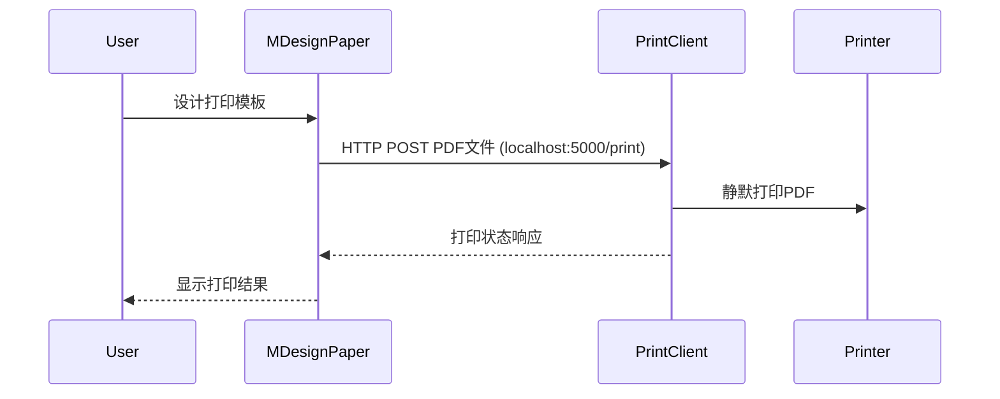

## 关于此工程 ##
blazor-hiprint 当时只是为了方便我（并非 hiprint 原作者） 在 Blazor 项目中引入使用，所以以此命名。
 
对于最后的文件打印，为了能够静默打印，我现在的想法是在与打印机相连的电脑或者打印服务器上安装打印客户端，需要打印的区域转换为PDF后发送至打印客户端。
 

## 组件交互关系 ##



## 打印客户端功能 ##
BlazorHiPrint.Client 包含一个打印客户端(Form1.cs)，提供以下功能：
- 启动HTTP服务监听5000端口
- 接收POST请求到 http://localhost:5000/print?filename=abc.pdf
- 从请求中获取PDF文件内容
- 自动使用默认打印机打印PDF文档
  
## MDesignPaper 使用说明 ##

MDesignPaper 是一个可拖拽的设计面板组件，用于创建打印模板。主要功能包括：

1. 支持多种纸张尺寸选择（A3/A4/A5/B3/B4/B5）和自定义尺寸（最大不超过A3）
2. 可拖拽添加各种元素（文本、表格、条形码、图形等）
3. 元素可编辑、删除和调整位置
4. 提供标尺辅助设计


### 基本用法 ###

```razor
@page "/design"
@using BlazorHiPrint.DesignPaper.Components

<MDesignPaper PrintItems="PrintItems" 
              OnComponentClicked="HandleItemClick">
</MDesignPaper>

@code {
    private List<PrintItem> PrintItems = new();
    
    private void HandleItemClick(PrintItem item)
    {
        // 处理元素点击事件
    }
}
```

### 完整示例 ###
参考 HiPrintV2.razor 实现：

1. 左侧拖拽面板提供可拖拽元素
2. 中间区域为 MDesignPaper 设计面板
3. 右侧为元素属性编辑器

## 💐特别鸣谢 

### 代码中使用了如下，但不限于如下的开源组件

- 👉 PdfiumViewer.Core [https://github.com/TimChen44/PdfiumViewer.Core](https://github.com/TimChen44/PdfiumViewer.Core)
- 👉 ZXing.Net [https://github.com/micjahn/ZXing.Net](https://github.com/micjahn/ZXing.Net)


### 部分样式及资源直接使用了

- 👉 vue-plugin-hiprint [https://gitee.com/CcSimple/vue-plugin-hiprint](https://gitee.com/CcSimple/vue-plugin-hiprinthttps://gitee.com/CcSimple/vue-plugin-hiprint)https://gitee.com/CcSimple/vue-plugin-hiprinthttps://gitee.com/CcSimple/vue-plugin-hiprint
- 👉CodeBeam.MudBlazor.Extensions [https://github.com/CodeBeamOrg/CodeBeam.MudBlazor.Extensions](https://github.com/CodeBeamOrg/CodeBeam.MudBlazor.Extensions)https://github.com/CodeBeamOrg/CodeBeam.MudBlazor.Extensions
